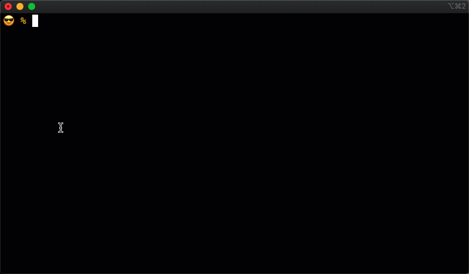

# Shell Completers for the Curity Identity Server

Using these completions, you can _quickly_ tab complete:

* Startup of an admin node
* Launching a new run-time node
* Dumping configuration 
* Reloading configuration 
* Checking the current version 
* and more

Here's a demo using Zsh:

## Bash Installation

To make sure its sourced on shell startup, put the `idsvr-completion` file in the `bash_completion.d` directory. Where that directory is depends on your OS.

* If using Mac OS X with homebrew, the path is `/usr/local/etc/bash_completion.d`.
* If using Linux, its probably in `/etc/bash_completion.d`.

## Zsh Installation

1. Download `_idsvr`.
2. Put the directory that contains the `_idsvr` function in your `fpath`, for example, `fpath+=($PWD/idsvr-completions)`, or put this script in a directory that is already in your `fpath`.
3. Make sure compsys is [initialized](https://zsh.zle.lc/zsh_20.html#Initialization). It is if you can tab complete other commands. If not, it should be enough to run `compinit` in your shell or your initialization file.
4. Then, you need to autoload the `_idsvr` script. To do this, run `autoload -U _idsvr idsvr idsh`. If you work for Curity, you'll want to do `autoload -U _idsvr idsvr idsh run dr`.

## More Information

Please visit [curity.io](https://curity.io/) for more information about the Curity Identity Server.

Copyright (C) 2018-2020 Curity AB.